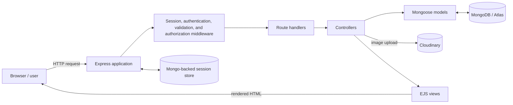
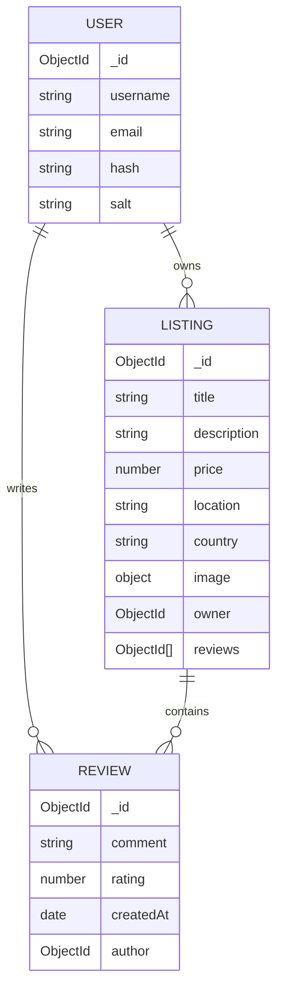

# MapMyStay

MapMyStay is a full-stack, server-rendered accommodation discovery and review platform. Visitors can browse stays and read reviews, while registered users can publish properties, upload images, manage their own listings, and leave ratings and comments.

**Live application:** [mapmystay-jeon.onrender.com/listings](https://mapmystay-jeon.onrender.com/listings)

> MapMyStay currently supports listing discovery and community reviews. It does not yet implement availability calendars, reservations, payments, maps, or host–guest messaging.

## Table of contents

- [Features](#features)
- [Use cases and access control](#use-cases-and-access-control)
- [Technology stack](#technology-stack)
- [Architecture](#architecture)
- [System design and request flow](#system-design-and-request-flow)
- [Data model](#data-model)
- [Routes](#routes)
- [Project structure](#project-structure)
- [Local setup](#local-setup)
- [Environment variables](#environment-variables)
- [Sample data](#sample-data)
- [Validation, security, and reliability](#validation-security-and-reliability)
- [Known limitations](#known-limitations)
- [Possible improvements](#possible-improvements)

## Features

- Browse all accommodation listings without signing in.
- Open a listing to see its image, host, description, nightly price, location, country, and reviews.
- Create an account using a username, email address, and password.
- Sign in with local username/password authentication and remain signed in through a server-side session.
- Return to the originally requested protected page after signing in.
- Create a listing with an image uploaded to Cloudinary.
- Edit or delete a listing only when the current user owns it.
- Add a 1–5 star rating and comment while signed in.
- Delete a review only when the current user authored it.
- Display success and error feedback using flash messages.
- Show prices in Indian number formatting and optionally reveal the `+18% GST` label in the interface.
- Use responsive EJS views styled with Bootstrap, custom CSS, Font Awesome, and Starability ratings.

## Use cases and access control

| Actor | Use case | Access |
|---|---|---|
| Visitor | Browse listings and view listing details/reviews | Public |
| Visitor | Sign up or sign in | Public |
| Registered user | Create a listing | Authenticated |
| Listing owner | Edit or delete their listing | Authenticated + owner check |
| Registered user | Add a review | Authenticated |
| Review author | Delete their review | Authenticated + author check |
| Registered user | Sign out | Authenticated session |

The application is a marketplace-style catalogue rather than a booking engine. A typical user journey is:

1. Browse the catalogue at `/listings`.
2. Open a property detail page.
3. Sign up or log in when attempting a protected action.
4. Publish a property or review an existing one.
5. Manage only the content they own.

## Technology stack

| Layer | Technology | Responsibility |
|---|---|---|
| Runtime | Node.js 20.14.0 | Executes the application |
| Web server | Express 4 | Routing, middleware, HTTP handling |
| Views | EJS + EJS-Mate | Server-rendered pages and shared layout |
| UI | Bootstrap 5, custom CSS, Font Awesome | Responsive presentation and icons |
| Database | MongoDB + Mongoose | Users, listings, reviews, and relationships |
| Authentication | Passport, Passport Local, Passport-Local-Mongoose | Registration, password hashing, login, serialization |
| Sessions | Express Session + Connect Mongo | Persistent server-side login sessions |
| Validation | Joi | Request-body validation for listings and reviews |
| Images | Multer + Cloudinary | Multipart upload handling and cloud image storage |
| Feedback | Connect Flash | One-time success and error messages |

## Architecture

MapMyStay follows a traditional **Model–View–Controller (MVC)** design with a middleware layer for cross-cutting concerns.



### Layer responsibilities

- **Entry point (`app.js`)** configures MongoDB, sessions, Passport, static files, view rendering, routers, 404 handling, and the global error handler.
- **Routes (`Routes/`)** define URL and HTTP method mappings, then compose middleware with controller actions.
- **Controllers (`controllers/`)** implement application behavior: query data, create/update/delete documents, set flash messages, and choose redirects or views.
- **Models (`models/`)** define MongoDB document structures and references between users, listings, and reviews.
- **Middleware (`middleware.js`)** protects authenticated operations, enforces ownership, preserves redirect destinations, and validates incoming form data.
- **Views (`views/`)** render HTML on the server using a shared EJS-Mate layout and reusable navbar, footer, and flash-message partials.
- **Public assets (`public/`)** contain CSS and client-side Bootstrap form-validation behavior.

## System design and request flow

### Read flow: view a listing

```mermaid
sequenceDiagram
    actor User
    participant Express
    participant Controller
    participant MongoDB
    participant EJS
    User->>Express: GET /listings/:id
    Express->>Controller: showListing()
    Controller->>MongoDB: Find listing; populate owner, reviews, review authors
    MongoDB-->>Controller: Hydrated listing document
    Controller->>EJS: Render listings/show.ejs
    EJS-->>User: HTML listing page
```

### Protected write flow: update a listing

1. `method-override` converts the form's `POST ...?_method=PUT` into a `PUT` request.
2. `isLoggedIn` verifies that Passport restored an authenticated user from the session.
3. `isOwner` loads the listing and compares its owner ID with the current user ID.
4. Multer processes an optional replacement image and Cloudinary stores it.
5. Joi validates the listing fields.
6. The controller updates MongoDB, flashes a success message, and redirects to the detail page.

### Authentication and session design

- Passport Local authenticates a username and password.
- Passport-Local-Mongoose adds username/password support to the user model and stores salted password hashes; plaintext passwords are not saved by application code.
- Passport serializes the user identifier into the session and restores the user on later requests.
- Connect Mongo stores session data in MongoDB, allowing sessions to survive process restarts and work across multiple application instances.
- The browser receives an HTTP-only cookie with a seven-day lifetime.

### Image upload flow

The listing form uses `multipart/form-data`. Multer reads the `listing[image]` field, and `multer-storage-cloudinary` streams supported PNG/JPG/JPEG files to the `wanderlusts_dev` Cloudinary folder. The returned URL and Cloudinary filename are stored on the listing document.

## Data model



### Relationships

- A user can own many listings; each listing references one owner.
- A user can write many reviews; each review references one author.
- A listing holds an array of review IDs.
- The listing detail query populates the owner, reviews, and each review's author for display.
- The listing model intends to remove associated review documents when a listing is deleted (see [Known limitations](#known-limitations)).

## Routes

### Listing routes

| Method | Path | Purpose | Protection |
|---|---|---|---|
| `GET` | `/listings` | Show all listings | Public |
| `GET` | `/listings/new` | Render the create form | Signed in |
| `POST` | `/listings` | Upload an image and create a listing | Signed in + Joi validation |
| `GET` | `/listings/:id` | Show one listing and its reviews | Public |
| `GET` | `/listings/:id/edit` | Render the edit form | Owner only |
| `PUT` | `/listings/:id` | Update listing fields and optional image | Owner only + Joi validation |
| `DELETE` | `/listings/:id` | Delete a listing | Owner only |

### Review routes

| Method | Path | Purpose | Protection |
|---|---|---|---|
| `POST` | `/listings/:id/reviews` | Add a rating and comment | Signed in + Joi validation |
| `DELETE` | `/listings/:id/reviews/:reviewId` | Delete a review | Review author only |

### User routes

| Method | Path | Purpose | Protection |
|---|---|---|---|
| `GET` | `/signup` | Render registration form | Public |
| `POST` | `/signup` | Register and automatically sign in | Public |
| `GET` | `/login` | Render login form | Public |
| `POST` | `/login` | Authenticate and redirect | Public |
| `GET` | `/logout` | End the current session | Public route; meaningful when signed in |

Unmatched paths are forwarded to the global 404 handler and rendered through `views/error.ejs`.

## Project structure

```text
MapMyStay/
├── app.js                  # Application bootstrap and middleware pipeline
├── cloudConfig.js          # Cloudinary client and Multer storage adapter
├── middleware.js           # Auth, ownership, and validation middleware
├── schema.js               # Joi request schemas
├── controllers/            # Listing, review, and user business logic
├── Routes/                 # Express routers
├── models/                 # Mongoose User, Listing, and Review models
├── views/
│   ├── layouts/            # Shared EJS-Mate page shell
│   ├── Includes/           # Navbar, footer, and flash partials
│   ├── listings/           # Index, details, create, and edit pages
│   └── users/              # Signup and login pages
├── public/
│   ├── CSS/                # Site and rating styles
│   └── JS/                 # Browser-side form validation
├── init/                   # Development seed data and initializer
├── utils/                  # Async wrapper and custom HTTP error class
├── package.json
└── README.md
```

## Local setup

### Prerequisites

- Node.js **20.14.0** (the version declared in `package.json`)
- npm
- A MongoDB deployment (local MongoDB or MongoDB Atlas)
- A Cloudinary account

### Installation

```bash
git clone <repository-url>
cd MapMyStay
npm install
```

Create a `.env` file in the project root:

```dotenv
ATLASBD_URL=mongodb://127.0.0.1:27017/mapmystay
SECRET=replace-with-a-long-random-value
CLOUD_NAME=your-cloudinary-cloud-name
CLOUD_API_KEY=your-cloudinary-api-key
CLOUD_API_SECRET=your-cloudinary-api-secret
```

Start the application:

```bash
node app.js
```

Then open [http://localhost:8080/listings](http://localhost:8080/listings).

> The environment key is intentionally documented as `ATLASBD_URL` because that is the exact name currently read by `app.js` (including the `BD` spelling).

## Environment variables

| Variable | Required | Used for |
|---|---:|---|
| `ATLASBD_URL` | Yes | Main Mongoose connection and Mongo-backed session store |
| `SECRET` | Yes | Connect Mongo session-store encryption setting |
| `CLOUD_NAME` | Yes | Cloudinary account name |
| `CLOUD_API_KEY` | Yes | Cloudinary API authentication |
| `CLOUD_API_SECRET` | Yes | Cloudinary API authentication |
| `NODE_ENV` | No | Set to `production` to skip loading `.env` through Dotenv |

Never commit `.env` or real database/Cloudinary credentials.

## Sample data

`init/data.js` contains example properties. `init/index.js` can reset and populate a **local** database named `wanderlusts`, but it currently:

- deletes every existing listing in that database;
- assigns every seeded listing to one hard-coded user ID; and
- does not read `ATLASBD_URL`.

Before running it, replace the owner ID with an ID that exists in your local `users` collection. Because the operation is destructive, use it only against a disposable development database:

```bash
node init/index.js
```

## Validation, security, and reliability

### Implemented controls

- Password hashing and salting through Passport-Local-Mongoose.
- Server-side authentication checks for create, update, delete, and review operations.
- Object-level authorization for listing owners and review authors.
- Joi validation for listing and review request bodies.
- HTTP-only session cookie.
- Session persistence in MongoDB instead of process memory.
- Central async-error forwarding through `wrapAsync` and a global error page.
- Cloudinary file-format allow-list for PNG, JPG, and JPEG uploads.

### Production hardening recommended

- Move the hard-coded Express session secret in `app.js` to an environment variable and use one strong secret consistently.
- Enable secure cookies in production (`secure: true`) and set an appropriate `sameSite` policy.
- Add CSRF protection to state-changing form submissions.
- Add rate limiting, login throttling, and security headers (for example, Helmet).
- Validate upload size and MIME type as well as the Cloudinary format.
- Remove the public `/demouser` development route before production use.
- Replace logout-via-`GET` with a CSRF-protected `POST` request.
- Add structured logging and avoid logging complete user/listing documents.

## Known limitations

These observations describe the current codebase and are useful when extending it:

- There is no automated test suite; `npm test` is currently a placeholder that exits with an error.
- There is no `start` script, so the server is launched with `node app.js`.
- Search and category controls are visual only; they do not currently filter database results.
- The tax switch reveals a GST label but does not calculate a tax-inclusive total.
- Bookings, availability, payment, maps, favorites, pagination, and messaging are not implemented.
- Image upload is effectively required when creating a listing because the controller reads `req.file.path`, although the HTML and Joi schema do not require a file.
- Replacing or deleting a listing does not remove its old Cloudinary image, which can leave unused assets.
- The Mongoose deletion hook is registered as `findoneAndDelete`; Mongoose middleware names are case-sensitive, so review cascade deletion may not run as intended. It should be verified and changed to `findOneAndDelete`.
- Some missing-record paths do not return after redirecting and some authorization middleware assumes the referenced document exists, which can lead to secondary errors.
- The review delete button is rendered for every visitor, although the server correctly restricts deletion to the review author.
- The edit form's description textarea does not place the existing description between its tags, so it appears empty.
- Error responses render a page but do not explicitly apply `res.status(statusCode)`.
- User email addresses are required but are not marked unique and are only minimally validated.
- The server port is fixed at `8080` instead of reading a deployment-provided `PORT` variable.

## Possible improvements

1. Fix the correctness and security items listed above and add integration tests for authentication and authorization.
2. Add database-backed search, filters, sorting, and pagination.
3. Introduce geocoding and an interactive map for location discovery.
4. Add favorites, availability calendars, reservation records, and payment processing.
5. Calculate aggregate ratings and display review counts on catalogue cards.
6. Add image cleanup, multiple-image galleries, upload limits, and optimized Cloudinary transformations.
7. Add accessibility checks, empty states, and consistent MapMyStay branding across views.
8. Add production scripts, health checks, observability, and a CI pipeline.

---

MapMyStay is currently best suited as an MVC learning project and a foundation for a fuller accommodation marketplace.
